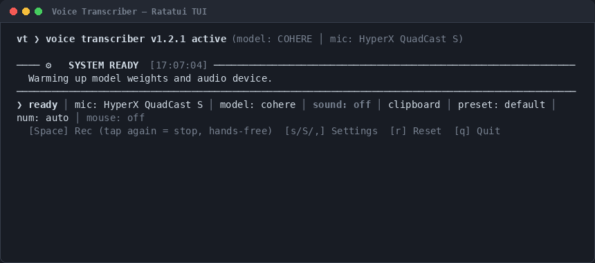

# Voice Transcriber

[](https://github.com/jjamesmartiin/voice-transcriber/releases/latest)
[](https://github.com/jjamesmartiin/voice-transcriber/actions)
[](LICENSE)
[](#platform-support)

**Voice Transcriber** is a private, ultra-low-latency voice dictation engine with system-wide push-to-talk hotkeys and instant text injection. Hold a global shortcut anywhere on your desktop, speak naturally, and clean formatted text types directly into your focused window — browser, IDE, terminal, or chat.



### Why Voice Transcriber?

- **100% Offline & Private**: Powered by local Cohere Transcribe weights (`cohere-transcribe-03-2026`). Zero API keys, zero cloud subscriptions, zero telemetry.
- **Microsecond Post-Processing (~16 µs)**: Removes verbal retractions (*"no wait, make that Wednesday"*), parses spoken ordinals/dates (*"October 20th"*), converts numbers to digits, and applies personal developer dictionaries with homophone guards (*"push to Gitea"* vs *"cup of tea"*).
- **Push-to-Talk + Hands-Free Space Latch**: Hold `Alt+Shift` (or middle mouse button) anywhere on the desktop to talk. Tap `Space` while holding to latch hands-free. `Alt+Shift` is just the default — the settings modal (or `vt hotkey add`) binds as many chords as you like.
- **Direct OS Keystroke Injection**: Types natively into any focused window across Linux (Wayland `uinput`/`ydotool`, X11), Windows (Win32 `SendInput`), and WSL2.
- **Ratatui Terminal REPL**: High-performance inline Rust TUI with live status, all-time time-saved tracking, and simultaneous multi-device microphone VU metering.

---

## Platform Support

| Platform | Status | Hotkeys | Output injection | Audio capture | Guide | Quick run |
| :--- | :--- | :--- | :--- | :--- | :--- | :--- |
| **Linux (Wayland / X11)** | Supported | `evdev` + `uinput` | `wl-copy`/`xclip` (copy) · `ydotool`/`xdotool` (type) | PulseAudio / PipeWire | [Linux guide](platforms/linux/README.md) | `vt-x86_64.AppImage`, or `nix run .` |
| **Windows (native)** | Supported | `pynput` + `keyboard` | Win32 `SendInput` (Unicode/emoji) | WASAPI / DirectSound | [Windows guide](platforms/windows/README.md) | EXE folder, or `run.bat` from source |
| **Windows (WSL2, any distro)** | Supported | Windows-host bridge (PowerShell ⇄ socket IPC) | Host-side synthetic paste (`clip.exe` + `Ctrl+V`) | WSLg PulseAudio (`RDPSource`) | [WSL guide](platforms/wsl/README.md) | Double-click `run_wsl.bat` |
| **macOS (Apple Silicon / Intel)** | Supported | `pynput` (Accessibility) | `pbcopy` (copy) · AppleScript / Quartz (type) | CoreAudio | [macOS guide](platforms/macos/README.md) | `nix run .`, or `./setup.sh` + `./run.sh` |

All four share the same engine, ASR backend, post-processor, and config format.
Only the HAL backends differ: **hotkeys**, **clipboard/typing**,
**audio cues**, and **notifications** (`src/platform/<os>/`).

---

## Requirements

Read the **Common** table first — it applies to every platform — then the table
for the platform you are targeting.

### Common (all platforms)

| Requirement | Detail |
| :--- | :--- |
| **CPU** | `x86_64` or `arm64`. Inference is **CPU-only** — no GPU is required or used. |
| **Disk (running from source)** | ~4 GB for the Cohere weights (`model.safetensors` is 3.9 GB) plus ~1.5 GB for the Python environment — budget ~6 GB. |
| **Disk (standalone Windows EXE)** | ~6 GB — the bundle carries its own Python, PyTorch, and the full 3.9 GB model. |
| **Network** | ~2.8 GB download on **first launch only**, for the compressed model weights. Fully offline afterwards. Set `VT_AUTO_DOWNLOAD_MODEL=0` to skip the download and supply weights yourself. |
| **Model weights** | Auto-installed on first run, or provided via `VT_MODEL_DIR` / a local `models/cohere/`. The download is split-xz and needs ~2.8 GB down / ~4 GB on disk. |
| **Audio** | A working microphone exposed as the system default input device. |
| **Python** | **3.10+** — only needed to run from source or to build. The Nix package and the Windows EXE bundle their own interpreter. |

### Linux (Wayland / X11)

| Requirement | Detail |
| :--- | :--- |
| **Architecture** | `x86_64-linux` or `aarch64-linux` (both are flake outputs). |
| **Nix (recommended)** | Nix with flakes enabled. `nix run .` supplies Python, PyTorch, PortAudio, `wl-clipboard`, `evdev`, and `uinput` — nothing else to install. |
| **Python (alternative)** | Python 3.10+ with the dependencies from `flake.nix` / `platforms/windows/requirements.txt`. |
| **Audio server** | PipeWire or PulseAudio running, with your microphone as the default source. |
| **`input` group** | Required for global hotkeys without root: `sudo usermod -a -G input $USER`, then re-login. |
| **evdev + uinput** | Read access to `/dev/input/event*` and the `uinput` kernel module. Powers push-to-talk, the mouse chord, and synthetic keystrokes. |
| **Clipboard sink** | Wayland: `wl-clipboard`. X11: `xclip` to copy. |
| **Auto-type** | `ydotool` (Wayland or X11) or `xdotool` (X11). Without them the app degrades to clipboard-only output. |
| **Optional** | `libnotify` (desktop notifications), `mpg123` / `lame` / `alsa-utils` (audio cues), `zenity` (GUI prompts). |

### Windows (native)

| Requirement | Detail |
| :--- | :--- |
| **OS** | Windows 10 or 11, 64-bit. |
| **Running from source** | Python 3.10+ installed from python.org with **"Add python.exe to PATH"** checked. |
| **Running the prebuilt EXE** | None of the above — the bundle is fully self-contained. |
| **Shell** | PowerShell 5.1+ (or PowerShell 7+). `setup.bat` / `run.bat` bypass the execution policy for you; invoking a raw `.ps1` needs `-ExecutionPolicy Bypass`. |
| **Microphone** | Windows Settings → Privacy & security → Microphone → allow **microphone access** and **let desktop apps access your microphone**. |
| **Path length** | Keep the checkout at a short path (e.g. `C:\voice-transcriber`) or enable `LongPathsEnabled`, otherwise `pip` fails with `[WinError 206]`. `setup.bat` offers to enable it via one UAC prompt. |
| **Admin** | Not normally required. Only the optional long-path registry change prompts for elevation. |
| **Frontend** | The Rich (Python) frontend is the default on native Windows; the ratatui TUI is opt-in via `VT_TUI_BIN`. |

### Windows via WSL2 (NixOS)

| Requirement | Detail |
| :--- | :--- |
| **OS** | Windows 10 (2004+) or 11, 64-bit. |
| **Virtualization** | **Virtual Machine Platform** and **WSL2** enabled — one-time, Administrator. `platforms\wsl\enable_wsl_features.bat` or `setup_wsl.ps1` does it for you. |
| **Distro** | **NixOS-WSL** registered. `setup_wsl.ps1` downloads the `nixos.wsl` image and registers it. |
| **Nix** | Nix with `nix-command` and `flakes` (the setup script writes `~/.config/nix/nix.conf`). |
| **Audio** | **WSLg** (bundled with modern WSL) provides the PulseAudio server at `/mnt/wslg/runtime-dir/pulse/native`. No extra audio setup. |
| **Host microphone** | Same Windows privacy setting as native — allow microphone access for desktop apps. |
| **Disk** | ~4 GB+ for the Nix store, plus ~4 GB for the model weights. |
| **Bridge** | Windows `powershell.exe` reachable from inside WSL — the global-hotkey bridge is a PowerShell process on the host. |

### macOS (Darwin)

| Requirement | Detail |
| :--- | :--- |
| **Architecture** | Apple Silicon (`aarch64-darwin`) or Intel (`x86_64-darwin`). |
| **Running from source** | Python 3.10+ and PortAudio (`brew install portaudio`). |
| **Nix** | Nix with flakes enabled (`nix run .`). |
| **Audio server** | macOS CoreAudio default input microphone. |
| **Accessibility permissions** | Required for global hotkeys and synthetic typing: *System Settings → Privacy & Security → Accessibility* (enable your Terminal / app). |
| **Microphone permissions** | Allow microphone access when prompted on first recording. |
| **Hardware Acceleration** | Apple Silicon MPS (Metal Performance Shaders) supported automatically. |

---

## Quick Start

### Quick Start by Platform

#### 🐧 Linux (Wayland / X11)

**End users: download the AppImage — no Nix, no Python, no setup.** Grab
`vt-x86_64.AppImage` from the [releases page](https://github.com/jjamesmartiin/voice-transcriber/releases),
`chmod +x` it, and run it. It bundles Python, PyTorch and the clipboard tools,
so it works on any glibc **x86_64** distro. The weights are **not** bundled: it
downloads them on first run, or reads a `model-bundle/` directory placed next to
the `.AppImage` (or set `VT_MODEL_SOURCE_DIR`) for a fully offline install.

```bash
chmod +x vt-x86_64.AppImage
./vt-x86_64.AppImage            # or --appimage-extract-and-run without FUSE 2
```

> **AppImage prerequisites (host-level, cannot be bundled):**
> - **FUSE 2:** if your distro ships only FUSE 3, install `libfuse2` or run
>   `./vt-x86_64.AppImage --appimage-extract-and-run` (equivalently
>   `APPIMAGE_EXTRACT_AND_RUN=1`).
> - **Global hotkeys:** `input` group membership and a writable `/dev/uinput`
>   (udev rule). **Typing:** `ydotool` on Wayland or `xdotool` on X11.
> - **GPU:** the bundle is **CPU-only**; CUDA needs host drivers and a
>   CUDA-enabled build (run from source / Nix).
>
> Only **x86_64-linux** is built today (see `TODO.md`).

**Running from a git checkout** (contributors / no AppImage):
```bash
# 1. One-time setup (venv + dependencies + model):
./setup.sh

# 2. Launch every time:
./run.sh
```
> **Note:** If you are not yet in the `input` group for global hotkeys, run `sudo usermod -aG input $USER` and log back in. Run `./run.sh doctor` to test permissions and audio devices anytime. With Nix installed, `nix run .` is the recommended path (it needs no venv).

#### 🪟 Windows (Native)
**Option A: Prebuilt Standalone EXE (no Python or build tools required)**
1. Download **`VoiceTranscriber-windows-x86_64.zip`** from [Latest Release](https://github.com/jjamesmartiin/voice-transcriber/releases/latest) and extract it anywhere.
2. Run **`VoiceTranscriber.exe`**.
3. On first launch, it will offer to download the Cohere model weights (~2.8 GB) automatically. If offline or preferred, drop the unpacked model files into `models\cohere\` next to `VoiceTranscriber.exe`.

**Option B: From Source (with local venv)**
From File Explorer or Command Prompt in the repo root:
```cmd
setup.bat     :: One-time: create .venv, install dependencies, get the model
run.bat       :: Launch (or: run.bat doctor)
```
> `setup.bat` also works offline: drop weights in `models\` and it uses them.

#### 🐧 Windows via WSL2 (any distro)
From File Explorer or Command Prompt in the repo root:
```cmd
setup_wsl.bat                :: one-time: register/configure a guest (NixOS default)
run_wsl.bat                  :: 1-click launcher (auto-picks NixOS if registered)
run_wsl.bat -Distro Ubuntu   :: use a specific WSL distribution
run_wsl.bat setup            :: install the app + model inside the guest
```
> The guest runs its own platform dispatcher, so **NixOS-WSL, Ubuntu-WSL, or any
distro with Nix** all work — it picks Nix or its native apt/venv path exactly
like bare Linux. Host hotkeys/clipboard go through the Windows PowerShell bridge.

#### 🍎 macOS (Apple Silicon / Intel)
```bash
./setup.sh    # one-time: venv + deps + model (checks brew portaudio)
./run.sh      # launch
```
> **Permissions note:** When prompted or in *System Settings → Privacy & Security*, allow **Accessibility** and **Microphone** access for your terminal app. Run `./run.sh doctor` to verify status.

---

## 🩺 System Self-Check (Doctor)

Voice Transcriber includes a built-in diagnostic tool to verify microphones, system permissions, hardware acceleration (CUDA/MPS/CPU), and model weight cache status:

```bash
# Linux / macOS:
./run.sh doctor

# Windows:
run.bat doctor
```

It also reports whether your **default microphone is muted**, which no other check can see: a muted source opens fine, reports sane channels and sample rate, and then records pure silence (Discord calls it *"no audio input detected"*). `doctor` fails loudly on it, and `--fix` unmutes it for you:

```bash
./run.sh doctor --fix     # Linux / macOS
run.bat doctor --fix      # Windows (no PipeWire: reported as unchecked, not failed)
```

---

## Controls

| Gesture | Action |
| :--- | :--- |
| **Your bound chords** (hold) — default **`Alt+Shift`** | **Push-to-Talk.** Hold while speaking; release to transcribe and paste/type into the active window. Any number of chords can be bound, including remapped and single keys (`f13`); see [Push-to-talk bindings](#push-to-talk-bindings). |
| **`Space`** (tap while holding a bound chord) | **Hands-Free Latch.** Release the keys and keep speaking; tap your chord again when finished. |
| **Middle-click** (hold) | **Mouse Push-to-Talk.** A press is buffered for a ~250 ms hold delay: releasing before it leaves the click a normal middle click, holding past it starts recording and the release stops it. On Linux a tap under ~100 ms is replayed untouched; a longer hold is swallowed so no primary-selection paste leaks. |
| **Left+right click** (within ~50 ms) | **Enter.** While mouse mode is on, a near-simultaneous left+right click is swallowed and replayed as one `Enter` keystroke. |
| **`Ctrl`** (held at release) | **Clipboard override.** Forces clipboard output for this utterance even when auto-type is enabled. |
| **`Space`** / **`Enter`** (in terminal) | **Start / stop recording.** Tap to start, tap again to stop — hands-free once started. |
| **`s`** / **`S`** / **`,`** (in terminal) | **Settings modal — the single configuration entry point.** Fuzzy search, in-place toggle badges, output modes, formatting, plus the microphone and theme sub-pickers and **Reset to Defaults**. |
| **`r`** (in terminal) | **Reset terminal & clipboard bridge.** |
| **`q`** / **`Esc`** / **`Ctrl+C`** (in terminal) | **Quit.** |

The settings modal is the only place settings are changed. There is deliberately
**no global hotkey for it** — a system-wide settings shortcut would fire while you
were typing in another application. Everything else (microphone, theme, mode
presets) is a sub-picker inside that modal. From outside the terminal, drive the
same actions with the [Control API](#control-api).

> **Two ways to record, one of them hands-free.** Hold a bound chord — or the
> middle mouse button — for push-to-talk anywhere on the desktop, and release to
> finish. Or tap `Space` in the terminal to start and tap it again to stop. While
> holding your chord, tapping `Space` *latches* the recording: let go of both
> keys and keep talking, then tap your chord again to finish.

### Push-to-talk bindings

`Alt+Shift` is only the shipped default. Binds are a list, edited three ways:

```bash
vt hotkey                          # list what is bound
vt hotkey add ctrl+shift           # add a chord (as many as you like)
vt hotkey add f13                  # a single key works too
vt hotkey remove alt+shift         # drop one
vt hotkey reset                    # back to Alt+Shift
```

…or with `a` / `d` inside **Settings → Push-to-Talk Keys**, or by hand:

```yaml
hotkeys:
  - keys: [alt, shift]
    action: dictate
  - keys: [f13]
    action: dictate
```

Key names are OS-neutral. **`vt hotkey keys`** is the authoritative list (it is
served straight from the one table the backends resolve through, so it cannot
drift), grouped and with aliases:

```bash
vt hotkey keys            # human-readable
vt hotkey keys --json     # [{name, group, aliases}, ...]
```

In short: modifiers (`ctrl` / `leftctrl` / `rightctrl`, `alt`, `shift`, `meta` —
also spelled `super` / `win` / `cmd`), `f1`–`f24`, letters, digits,
`space`/`tab`/`esc`/`enter`, `backspace`/`delete`/`insert`, the arrows plus
`home`/`end`/`pageup`/`pagedown`, and `capslock`/`printscreen`/`scrolllock`/
`pause`/`menu`. A bare modifier matches **either** side; `rightctrl+shift`
matches only the right one. Aliases resolve to the same chord, so `option+shift`
and `alt+shift` are one bind, not two.

Chords are evaluated against the *remapped* key stream, so a keyboard remapper
(`kanata`, `input-remapper`) can be the thing that produces your chord — hold
`s`+`f` and bind `alt+shift` to match what kanata emits, not the physical keys
underneath it.

The middle mouse button is deliberately *not* bindable: it already has its own
toggle with tap-vs-hold semantics.

Push-to-talk, the hands-free latch, and the ~250 ms middle-click hold delay are
portable across all three platforms. The only platform extra is the sub-100 ms
tap-replay decision window, which is Linux-only — see below.

The left+right → `Enter` chord is Linux-only: it needs `EVIOCGRAB` plus a
virtual mouse to suppress the underlying clicks. The backend mirrors each
grabbed mouse through `uinput`, so clicks gain at most a ~50 ms decision delay
and are otherwise replayed untouched — except middle click, where a sub-100 ms
tap is replayed normally and a longer hold is consumed for push-to-talk.
Absolute pointers (touchpads/tablets) are left alone so gesture support is
preserved. If grabbing or `uinput` is unavailable, the chord is skipped and
the mouse behaves normally.

---

## Control API

Any program can drive the engine — start and stop recording, change a setting,
read back the last transcript — without simulating keystrokes. The engine listens
on a Unix socket, and `main.py` itself is the client:

```bash
python src/main.py toggle        # start recording, or stop if already recording
python src/main.py start
python src/main.py stop
python src/main.py wait          # block until the transcript is ready
python src/main.py status        # state, device, model, output mode, ...
python src/main.py mics
python src/main.py set-mic "usb"
python src/main.py output type_fast
python src/main.py mute
python src/main.py help          # every verb
python src/main.py help --json   # machine-readable verb catalogue
```

Running `python src/main.py` with no verb still launches the app. Add `--json`
for machine-readable output, or `--socket PATH` to target a specific instance.
Under Nix the same verbs pass through the wrapper: `nix run . -- status`.

> **Not available on native Windows.** Stock CPython on Windows never exposes
> `socket.AF_UNIX`, so the engine does not bind the control socket there and
> every verb fails with `✗ AF_UNIX sockets are unavailable on this platform`. Use
> the terminal keys instead. **WSL works**, because the app runs on a Linux
> interpreter there. See
> [`docs/control_api.md`](docs/control_api.md#transport).

| | |
| :--- | :--- |
| **Socket** | `$XDG_RUNTIME_DIR/vt-control-<uid>.sock` — override with `VT_CONTROL_SOCKET` |
| **Protocol** | One newline-delimited JSON request and one reply per connection |
| **Concurrency** | Many clients at once; each is served on its own daemon thread |
| **Isolation** | A malformed or hostile request can never take the engine down |
| **Exit codes** | `0` ok, `1` rejected/no instance, `2` unknown verb |

| Group | Verbs |
| :--- | :--- |
| **Recording** | `start`, `stop`, `toggle`, `wait`, `status` |
| **Devices** | `mics`, `set-mic`, `rescan-mics` |
| **Settings** | `output`, `numbers`, `punctuation`, `theme`, `trailing-space`, `auto-punctuate`, `serial`, `spell`, `middle-click`, `mute` |
| **Modals** | `settings`, `mic` (interactive — take over the terminal) |
| **Lifecycle** | `reset-defaults`, `reset-terminal`, `ping`, `doctor`, `help`, `quit` |

Hand-typed clients work too, because a bare verb is accepted:

```bash
printf 'toggle\n' | socat - "UNIX-CONNECT:$XDG_RUNTIME_DIR/vt-control-$(id -u).sock"
```

**Full reference:** [`docs/control_api.md`](docs/control_api.md) — protocol and
reply shapes, every verb with its accepted values, scripting recipes, and a
section written for LLM agents (discover the surface with `help --json` rather
than guessing).

The engine and the control API share one command vocabulary, so tests can drive
a real running instance instead of reaching into internals — see
[`tests/shared/test_control.py`](tests/shared/test_control.py).

---

## Terminal UI

The default frontend is a [ratatui](https://ratatui.rs) (Rust) TUI, launched
automatically by the Python engine over a local socket — see
[`tui-rs/README.md`](tui-rs/README.md). `nix run` builds it via the flake; no
separate build step is needed.

Set `VT_TUI=rich` to force the original Rich frontend, or `VT_TUI_BIN=/path` to
point at a specific `vt-tui` binary (e.g. a local `cargo` build during frontend
development). If no binary is found, the app falls back to Rich automatically —
this is the default on native Windows.

Both frontends share the same visual layout and keyboard model — `s`/`S`/`,`
for settings, `Space`/`Enter` to record — with the microphone and theme
sub-pickers reached from inside the settings modal:
- **Interactive Modal Pickers**: `⚙️ Settings & Configuration`, `🎤 Microphone Input Device`, and `🎨 Select UI Color Theme` overlays with real-time search filtering, arrow/Tab navigation, and in-place toggling. The microphone picker shows a **live level for every visible device at once** — one capture stream per row — so you can see which mic is actually hearing you instead of selecting one and hoping. Streams follow the visible rows, so the search box also narrows what is monitored.
- **Inline CLI Prompt Stream**: Responsive status prompt line with active mic, model, sound, output mode, trailing space, punctuation, numbers, and mouse hold badges.
- **Clean Word-Wrapped Transcriptions**: Direct terminal scrollback with timing metadata dividers and zero border interference for 100% clean copy-paste.
- **Persistent Time-Saved Counter**: every transcription divider carries a `⚡ saved: +14s (session: 2m 15s · total: 1h 20m)` badge — the time dictation saved versus typing, the running session total, and an **all-time total that survives restarts**. The estimate uses the `typing_wpm` setting.
- **Encoding-safe output**: on a console or pipe that cannot encode the emoji and box-drawing glyphs (a legacy Windows code page, `LANG=C`, `PYTHONIOENCODING=ascii`), they degrade to ASCII stand-ins — `⚡`→`*`, `│`→`|`, `·`→`|` — instead of raising `UnicodeEncodeError` and losing the divider. Nothing is ever dropped silently. Set `VT_ASCII=1` to force the ASCII rendering everywhere.

---

## Architecture

> **Planning a port to another language?** Read
> [`docs/archive/java-fork-plan.md`](docs/archive/java-fork-plan.md). It maps what is reusable
> as-is (the `vt-tui` protocol, the control API, the revision-keyed weights
> bundle) and why the ASR re-host, not the port, is the critical path.

Voice Transcriber unifies all supported platforms over a single shared core
engine using a Hardware/OS Abstraction Layer (HAL):

```
Voice Transcriber Architecture
┌─────────────────────────────────────────────────────────────┐
│                      Core Engine (src/)                     │
│                                                             │
│  - Audio Pipeline & Streaming VAD (t2.py, micro_batcher.py) │
│  - ASR Engine (Cohere Transcribe)                           │
│  - Wispr Flow Post-Processor (post_processor.py)            │
│    * Trie-compacted dictionary replacer                     │
│    * Filler-word and stutter removal                        │
│    * Verbal retraction parser ("no wait", "scratch that")   │
│    * Spoken numbers to digits conversion                    │
│    * Spoken dates to ordinal days ("October 20th")          │
│    * Sentence casing & terminal punctuation                 │
│  - Lifetime stats & time-saved estimate (stats.py)          │
│  - TUI: ratatui (default) / Rich (fallback)                 │
└──────────────────────────────┬──────────────────────────────┘
                               │
            ┌──────────────────┴──────────────────┐
            ▼                                     ▼
┌──────────────────────┐              ┌──────────────────────┐
│  src/hal.py (Loader) │              │  src/platform/ (HAL) │
└───────────┬──────────┘              └──────────┬───────────┘
            │                                    │
    ┌───────┴───────────────┬────────────────────┼─────────────┴──────────┐
    ▼                       ▼                    ▼                        ▼
Linux (evdev/uinput,     Windows (pynput,     WSL (PowerShell bridge,  macOS (pynput, pbcopy,
 wl-copy/xclip/ydotool)   pyperclip, user32)   clip.exe interop)        osascript, afplay)
```

Platform detection lives in `src/platform/__init__.py`; override it with
`VT_PLATFORM=linux|windows|wsl|macos` (an unknown value is a hard error by design).

---

## Testing & CI

GitHub Actions runs a four-job matrix on every push and PR
(`.github/workflows/ci.yml`). Each job runs the **shared** tier plus its own
platform tier:

| CI job | Runner | Command |
| :--- | :--- | :--- |
| **Unit tests (Linux)** | `ubuntu-latest` | `pytest tests/shared tests/linux` (Nix dev shell) |
| **Unit tests (macOS)** | `macos-latest` | `pytest tests/shared tests/macos` |
| **Unit tests (Windows)** | `windows-latest` | `pytest tests/shared tests/windows` (no PyTorch needed) |
| **Unit tests (WSL)** | `ubuntu-latest` | `pytest tests/shared tests/wsl` (Nix, `VT_PLATFORM=wsl`) |

The Linux job also lints (`ruff check`, `shellcheck`) and builds the Rust
frontend (`nix build .#vt-tui`, which runs the crate's `cargo test`).

### Test tiers

| Tier | Directory | Needs model? | Runs where |
| :--- | :--- | :--- | :--- |
| **Shared** | `tests/shared/` | No | Every OS, every push |
| **Platform** | `tests/linux/`, `tests/macos/`, `tests/windows/`, `tests/wsl/` | No | That OS only, every push |
| **End-to-end** | `tests/e2e/` | Yes | Local only (never CI) |

### Running the tests locally

One command per tier, from the repo root:

| Tier | Linux / WSL | Windows |
| :--- | :--- | :--- |
| **All (shared + platform)** | `./test.sh` | `.\test.ps1` |
| **Shared only** | `./test.sh shared` | `.\test.ps1 shared` |
| **Platform only** | `./test.sh platform` | `.\test.ps1 windows` |
| **End-to-end (model)** | `./test.sh e2e` | `.\test.ps1 e2e` |

`./test.sh` auto-detects Linux vs WSL and runs the matching platform tier. Both
scripts forward extra args to pytest, e.g. `.\test.ps1 shared -k tui -v`. On
Windows the same thing is `test.bat` (or
`powershell -ExecutionPolicy Bypass -File .\platforms\windows\test.ps1`).
`setup.bat` installs pytest (from `platforms\windows\requirements-dev.txt`), and
`test.bat` / `test.ps1` install it on demand if it is missing.

### Mouse-mode coverage

Middle-click push-to-talk is pinned by
`tests/shared/test_mouse_mode_contract.py`, which runs in all three CI jobs and
drives each backend through its own event seam (skipping cleanly where a native
listener is unavailable). Windows-specific toggling lives in
`tests/windows/test_middle_click_hotkey.py`; the PowerShell host bridge is
pinned structurally in `tests/wsl/test_mouse_mode.py` (the WSL CI runner has no
`powershell.exe`). The Linux-only extras — tap-passthrough, left+right → Enter,
and suppressed X11 middle-click paste — live in
`tests/linux/test_middle_click_hotkey.py`.

The **end-to-end** tier needs the downloaded ASR model and (for the loopback
suite) a real speaker + mic, so it is intentionally **not** part of CI. See
[`docs/agent_testing_workflow.md`](docs/agent_testing_workflow.md) for the
release-quality protocol.

The [Control API](#control-api) lets a test drive a **real running instance** as
a black box (`toggle`, `status`, `output …`) instead of reaching into internals
or faking hotkeys. `tests/shared/test_control.py` pins the wire protocol, the
"a bad client cannot kill the engine" guarantees, and that every documented verb
is either handled or explicitly rejected.

### Quality gates

| Metric gate | Target SLA | Ceiling | Description |
| :--- | :--- | :--- | :--- |
| **Post-release latency** | $\le 1.00\text{ s}$ | $\le 1.50\text{ s}$ | Elapsed time from key release (`stop_recording`) to clipboard paste/typing. |
| **Accuracy match** | $\ge 90.0\%$ | $\ge 80.0\%$ | Match ratio against ground-truth benchmarks across words, phrases, and 30 s speech. |
| **Hallucination rejection** | $0$ noise tokens | $0$ noise tokens | Ambient room noise or silence must return the empty string `""`. |
| **Punctuation coverage** | $100\%$ | $100\%$ | Multi-word sentences must terminate with valid punctuation (`.`, `!`, `?`). |

The **Ceiling** column is the enforced value: `tests/e2e/test_end_to_end_crossplatform.py`
asserts `POST_RELEASE_LATENCY_BUDGET_SEC = 1.5` and `ACCURACY_FLOOR = 0.80`, so a
run that breaches the ceiling fails rather than merely regresses. The Target SLA
is the goal the implementation is tuned for.

---

## Model Weights & Offline Operation

The only backend is **Cohere Transcribe**
(`CohereLabs/cohere-transcribe-03-2026`, Apache-2.0, ~4 GB on disk / ~2.8 GB
download). Acquisition order:

1. A local copy under `models/cohere/` (repo checkout) or `VT_MODEL_DIR`.
2. A per-user install dir (`%APPDATA%\vt\models\cohere` on Windows,
   `~/.local/share/vt/models/cohere` elsewhere, or `$XDG_DATA_HOME/vt`).
3. **Auto-download of the Apache-2.0 GitHub release asset** — no Hugging Face
   account or token required.

Once the weights are on disk the app runs **fully offline** with no network
access.

### Language Support & Disclaimer

- **Primary / Officially Supported**: **English (`en`)**
- **Model Architecture**: The underlying acoustic weights (`CohereLabs/cohere-transcribe-03-2026`) support 14 languages: English (`en`), French (`fr`), German (`de`), Spanish (`es`), Italian (`it`), Portuguese (`pt`), Dutch (`nl`), Polish (`pl`), Greek (`el`), Arabic (`ar`), Japanese (`ja`), Chinese (`zh`), Vietnamese (`vi`), and Korean (`ko`).
- **English Pipeline Disclaimer**: Voice Transcriber is designed and optimized specifically for **English dictation**. The post-processor (verbal retraction parser like *"scratch that"*, filler-word removal, stutter collapse, number-to-digit conversion, homophone disambiguation, and casing) is written exclusively for English. Other languages can be specified via `VT_LANGUAGE` or `config.yaml` (`language: "<code\>"`), but English is the primary officially supported language.

> **Note for Windows testers:** `models/` is gitignored, so a fresh clone has
> no weights. First launch auto-installs them from the GitHub release asset
> (~2.8 GB down, ~4 GB on disk), which is the one slow step (a few minutes on a
> fast connection, longer on a slow one) before dictation starts.

---

## Building Distributables

| Target | Command | Output |
| :--- | :--- | :--- |
| **Linux (Nix)** | `nix build .` (or `./build.sh`) | `result/bin/vt` |
| **Windows (offline EXE)** | `build.bat` (or `powershell -ExecutionPolicy Bypass -File .\platforms\windows\build.ps1`) | `dist/VoiceTranscriber/` (PyInstaller `--onedir`, bundles the model) |
| **Windows (model-free)** | `build.bat --no-model` | `dist/VoiceTranscriber/` (~1.1 GB; weights installed on first run) |

The Windows build is self-contained (~6 GB: Python + PyTorch + the 3.9 GB Cohere
model) and needs no Python install on the target machine. See
[`platforms/windows/plan-to-compile.md`](platforms/windows/plan-to-compile.md).

> **Airgapped / offline installs (any OS).** The app and the weights ship
> separately: a small model-free app bundle per OS, plus **one OS-agnostic split
> model bundle**. The app verifies and assembles the weights itself (`urllib` +
> `lzma` + `tarfile`, all bundled) — no external `xz`/`7z`/`unzip`, no Python on
> the target. Put the bundle in a `model-bundle/` directory next to the
> executable, or point `VT_MODEL_SOURCE_DIR` at it. See
> [`docs/offline_install.md`](docs/offline_install.md).

> **Prebuilt Windows binary:** `VoiceTranscriber-windows-x86_64.zip` is attached
> to every release on GitHub. It contains a self-contained Python runtime, PyTorch,
> and `VoiceTranscriber.exe`. Model weights are either auto-downloaded on first run
> or loaded from a `models\cohere\` folder placed next to the executable. You can
> also build a standalone bundle locally on Windows using `build.bat` (or
> `build.bat --no-model`). Once built, the whole `dist/VoiceTranscriber/` folder is
> portable to any compatible x64 Windows machine.

> **Stale `result/` symlink:** the `result/` symlink in a checkout points at the
> last `nix build`, which may predate recent frontend changes. Re-run `nix build .`
> (and re-launch) after pulling to pick up a rebuilt `vt-tui`.

> **Cutting a release?** See [`docs/releasing.md`](docs/releasing.md). CI builds
> and attaches the AppImage. The model weights are published **separately**, to
> a revision-keyed bundle tag, and only when the model revision actually
> changes — never per release. A new version reuses the existing bundle and
> uploads nothing; only a `REVISION` bump needs the publish step:
>
> ```bash
> nix develop --command ./scripts/publish_model_bundle.sh --dry-run  # show the plan
> nix develop --command ./scripts/publish_model_bundle.sh --build    # ~2.9 GB, once per revision
> ```

---

## Configuration

Settings live in `config/config.yaml`. To customize startup defaults, copy the
template:
```bash
cp config/example-config/config.yaml.example config/config.yaml
```

Supported options:
- `is_muted`: `true` or `false`.
- `output_mode`: `clipboard`, `type` (slow/safe), or `type_fast` (optimized).
- `auto_type`: `true` (direct keystroke injection) or `false` (clipboard only).
- `copy_to_clipboard`: `true` or `false`.
- `auto_type_trailing_space`: append a space after auto-typed text.
- `auto_type_auto_punctuate`: enforce terminal punctuation on auto-typed text.
- `number_digits`: `auto` (default: only consecutive spoken digit chains such as phone/serial numbers become digits, while ordinals and small isolated counts read as words — `"the 5th item"` → `"the fifth item"`, `"I have 2 dogs"` → `"I have two dogs"`), `digits` (always convert), or `words` (never convert). Legacy `true`/`false` are accepted as aliases for `digits`/`words`. Spoken dates are the one exception in `auto`/`digits`: the day is always written as an ordinal numeral (`"October twentieth"` → `"October 20th"`, `"the twentieth of October"` → `"the 20th of October"`, `"October twentieth twenty twenty five"` → `"October 20th, 2025"`); `words` mode leaves them spelled out.
- `serial_collapse`: `true` (default) writes serial numbers, model/part codes and NATO phonetic dictation as a single token (`"A B C 1 2 3"` → `ABC123`, `"Alpha Bravo 4"` → `AB4`); `false` keeps single-space separators. Prose is never touched: a quantity followed by the indefinite article (`"170 a month"`, `"20 a year"`) stays as spoken, so only trigger-anchored or unambiguous runs collapse.
- `spell_command`: `true` (default) enables the verbal spell command (`"spell C A T"` → `CAT`); `false` leaves `"spell ..."` phrases untouched.
- `keep_bluetooth_handsfree`: `true` keeps Bluetooth devices in hands-free mode so media does not pause when recording ends.
- `punctuation_mode`: `full`, `no_terminal_period`, `no_punctuation`, or `lowercase_no_punctuation` (legacy alias `semi-formal` → `no_terminal_period`).
- `enable_slm`: `true` to enable the optional local vLLM grammar-polish pass (default `false`).
- `sound_theme`: audio cue pack — `proximity` (default), `pop`, `chime`, or `silent`.
- `ui_theme`: `auto` (follow the terminal) or one of `green`, `cyan`, `blue`, `magenta`, `yellow`, `red`, `white`.
- `typing_wpm`: words-per-minute typing baseline used for the `⚡ saved` estimate (default `40`; preset cycling lives in the `wpm` control verb).
- `dictionary`: key-value map of custom phrase replacements (see `config/dictionary.yaml`).
- `dictionary_file`: path to an external YAML/JSON dictionary; takes precedence over the inline `dictionary` map.

`config/example-config/config.yaml.example` is the annotated reference for every
key, including the ones not listed above (`primary_device_name`,
`middle_click_enabled`, …). Any option can be overridden per-session with its
`VT_*` environment variable, e.g. `VT_OUTPUT_MODE=clipboard`, `VT_UI_THEME=cyan`.

> **Not everything is config.** The all-time time-saved totals live in
> `stats.json` in the platform data directory (`$XDG_DATA_HOME/vt/`,
> `~/.local/share/vt/`, or `%LOCALAPPDATA%\vt\`), **not** in `config.yaml` —
> `reset-defaults` and config edits never touch them. The file (and its
> directory) is created automatically on the first launch, and `stats.json` is
> gitignored wherever it lands. Point `VT_STATS_FILE` somewhere else, or delete
> the file to start counting from zero. Read the totals with
> `python src/main.py status` (Linux/macOS/WSL; on native Windows read the badge
> or the file, since the control API is unavailable there).

Options can also be changed live from the settings modal (`s`/`S`/`,` in the
terminal), or programmatically via the [Control API](#control-api).

---

## Custom Word & Phrase Dictionary

Voice Transcriber includes a high-speed Trie-compacted custom dictionary replacer (~0.005 ms execution time) that matches spoken words and technical phrases case-insensitively, respects word boundaries, and applies exact replacement casing and formatting.

### Two-Tier Dictionary Architecture

Voice Transcriber automatically layers two dictionaries at runtime with zero latency penalty:

1. **Common Dictionary (`config/dictionary.yaml`)**:
   - **Committed to git**.
   - Shipped with the repository for shared developer tools, cloud infrastructure, and open-source packages (`kubectl`, `NixOS`, `systemctl`, `GitHub`, `0xDEADBEEF`, `UART`, etc.).
2. **Personal / Local Dictionary (`config/dictionary.local.yaml`)**:
   - **Gitignored** (`.gitignore`).
   - Private to your machine. Used for personal system hostnames (`home-jamesm5`), family/coworker names, client names, private project codenames, or personal addresses.
   - Simply copy `config/dictionary.local.yaml` to transfer your personal vocabulary between computers!

Local definitions take precedence over common definitions if there is an overlap.

### Quick-Add via CLI

You can add, list, remove, or test dictionary entries directly from the terminal without manually editing YAML files:

```bash
# Add to your personal dictionary (default, gitignored)
python -m src.dictionary add "home dash james m5" "home-jamesm5"
python -m src.dictionary add "john doe" "John Doe"

# Add to the common dictionary (tracked in git)
python -m src.dictionary add --common "cube ctl" "kubectl"
python -m src.dictionary add --common "deep seq" "Deepseek"

# Test how a sentence is transformed by the combined dictionaries
python -m src.dictionary test "i deployed on home dash james m5 using cube ctl"
# Output: "I deployed on home-jamesm5 using kubectl."

# List current dictionary entries (shows [common] vs [local] tags)
python -m src.dictionary list
python -m src.dictionary list james
python -m src.dictionary list --local

# Check dictionary file paths and status
python -m src.dictionary path

# Remove an entry
python -m src.dictionary remove "home dash james m5"
```

### Manual YAML Editing

You can edit `config/dictionary.local.yaml` (personal) or `config/dictionary.yaml` (common) directly:

```yaml
dictionary:
  # Spoken phrase: Desired Output
  cube ctl: kubectl
  k eight s: Kubernetes
  git hub: GitHub
  pull request: PR
  pull request review: PR review
  c pipeline: CI pipeline
```

- **Case-Insensitive Matching**: `github`, `GitHub`, and `GIT HUB` all match the rule.
- **Word-Boundary Protection**: Shorter words will not corrupt longer words (e.g., `pr` will not match the "pr" inside "program" or "spring").
- **Acronym Preservation**: Target words with capital letters (e.g., `GitHub`, `PR`, `Kubernetes`, `CI`) are automatically protected from mid-sentence lowercasing.

### Contextual Disambiguation Rules

Some technical terms sound identical to everyday English words (homophones). For example:
- *"push to **get tea**"* should become *"push to **Gitea**"*, but *"would you like to **get tea** with me?"* must remain untouched.
- *"connect over **you art** port"* should become *"connect over **UART** port"*, but *"are you an **art** student?"* must remain untouched.

Contextual rules solve this by requiring surrounding trigger words (before or after) and guarding against everyday English vocabulary:

```yaml
contextual_rules:
  - target: Gitea
    spoken: ["get tea", "git tea", "git ea"]
    triggers_before: ["push to", "pull from", "clone from", "commit to", "repo on", "hosted on", "our"]
    triggers_after: ["server", "instance", "repo", "repository", "remote", "url"]
    guards: ["cup of", "drink", "hot", "iced", "with", "would you like to", "order"]
```

#### Managing Contextual Rules via CLI
```bash
# Add a contextual rule
python -m src.dictionary add-contextual \
  --target "Gitea" \
  --spoken "get tea, git tea" \
  --before "push to, pull from, clone from, hosted on" \
  --after "server, repo, instance" \
  --guards "cup of, drink, iced, green, with, like to"

# List configured contextual rules
python -m src.dictionary list-contextual

# Remove a contextual rule
python -m src.dictionary remove-contextual "Gitea"
```

#### Prompting an LLM to Generate Rules
If you ask an AI assistant to add a technical term, you can simply give it examples:
> *"Whenever I say 'you art', I mean 'UART' when talking about serial ports or pins, but keep it 'art' if I talk about museums or drawing."*

The LLM can directly emit the clean YAML entry:
```yaml
  - target: UART
    spoken: ["you art", "u art"]
    triggers_after: ["port", "bus", "pins", "interface", "baud"]
    guards: ["museum", "gallery", "drawing", "class", "student"]
```

---

## License

MIT License. See [LICENSE](LICENSE). The bundled Cohere Transcribe model is
distributed under Apache-2.0 (see `config/licenses/`).
