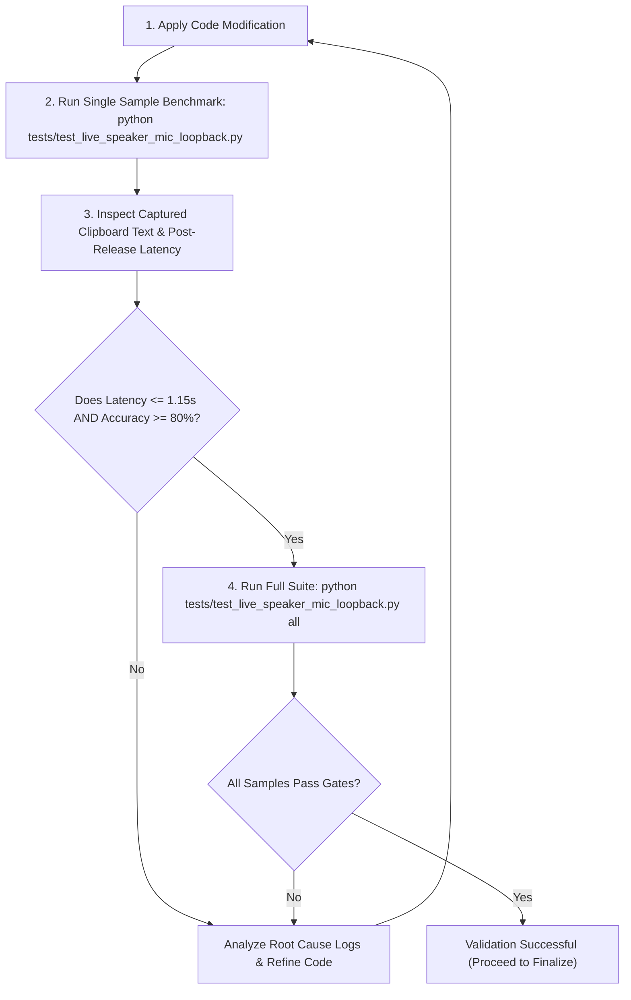

# AI Agent Quality Control & Automated Endpoint Testing Protocol

This document defines the mandatory validation rules and performance SLA gates that any AI Agent (or contributor) must satisfy before making code changes to **Voice Transcriber**.

---

## 1. Quality Control SLA Gates

Any modifications to the audio capture, micro-batcher, ASR decoding engine, or Wispr Flow post-processor must pass the following quantitative benchmarks:

| Metric Gate | Target SLA Threshold | Mandatory Rule |
| :--- | :--- | :--- |
| **Post-Release Latency** | **$\le 1.50$ seconds (ideally $\le 1.0$s)** | Total latency from key release (`stop_recording`) to clipboard copy must remain under 1.50 seconds across all samples. |
| **Transcription Accuracy** | **$\ge 80.0\%$ (Target 100%)** | Accuracy match ratio against ground truth reference text must meet or exceed 80% across all sample types. |
| **No Hallucinations** | **0 Unwanted Tokens** | Short audio recordings or room noise must return empty string `""` without emitting single-word noise tokens (e.g. `"you"`). |
| **Terminal Punctuation** | **100% Punctuation Coverage** | Complete multi-word statements must terminate with proper sentence-ending punctuation (`.`, `!`, `?`). |

---

## 2. Automated Test Execution Commands

Before finalizing any changes, the AI Agent must execute the acoustic loopback integration test suite in the Nix environment:

```bash
# 1. Run full live speaker-to-microphone loopback suite
nix develop --command python tests/test_live_speaker_mic_loopback.py all

# 2. Run fast unit test suite (micro-batching, VAD, casing, post-processor)
nix develop --command python tests/test_micro_batcher_fast.py

# 3. Run synthetic end-to-end latency benchmarks
nix develop --command python tests/benchmark_synthetic_e2e.py
```

---

## 3. Agent Self-Validation & Clipboard Verification Protocol

When validating code modifications, the AI Agent follows an iterative 4-step loop:



### Validation Sample Checklist
- [x] `short_word`: Single-word pickup (1.0s audio, expected: `"Fearless."`)
- [x] `short_phrase`: Short phrase (1.3s audio, expected: `"Good morning."`)
- [x] `1`: Single paragraph (4.98s audio)
- [x] `2`: Multi-sentence passage (8.98s audio)
- [x] `3`: Technical passage (10.37s audio)
- [x] `long_30s`: Continuous long dictation (30.77s audio)
