# Voice Transcriber: Technical Architecture & Execution Flow

This document details the end-to-end architecture, mathematical decision trees, and component execution flows of **Voice Transcriber**—from kernel key-press detection to cross-platform clipboard delivery and screen typing.

---

## 1. High-Level System Architecture

```mermaid
graph TD
    subgraph Input & Hotkey Subsystem
        evdev["evdev Kernel Listener (/dev/input/event*)"] -->|Key State Event| HotkeyEngine["hotkeys.py (GlobalHotkeys)"]
        HotkeyEngine -->|uinput Filter| SelfLoopFilter{"Is Virtual uinput Event?"}
        SelfLoopFilter -->|Yes| IgnoreEvent["Ignore (Prevent Self-Loops)"]
        SelfLoopFilter -->|No| TriggerCallback["Trigger start_recording / stop_recording"]
    end

    subgraph Audio Recording & Hardware Subsystem
        TriggerCallback -->|Start Keydown| MainApp["main.py (SimpleVoiceTranscriber)"]
        MainApp -->|Initialize| SoundDevice["t2.py (PortAudio / sounddevice)"]
        SoundDevice -->|Select Device| ConfigLoader{"Config Hierarchy (config.yaml)"}
        ConfigLoader -->|Primary/Secondary| AudioStream["16kHz PCM Stream (float32)"]
    end

    subgraph Streaming Micro-Batching Subsystem
        AudioStream -->|PCM Buffer Chunks| MicroBatcher["micro_batcher.py (StreamingMicroBatcher)"]
        MicroBatcher -->|RMS & Peak Calc| EnergyGate{"Energy Gate (Peak >= 0.015, RMS >= 0.0035)"}
        EnergyGate -->|Silence| DiscardSilence["Discard / Reset Buffer"]
        EnergyGate -->|Speech Signal| DispatchChunk["Dispatch Audio Chunk (3.0s - 7.0s)"]
        DispatchChunk -->|Trailing Tail| SilenceTrimmer["trim_trailing_silence (150ms Cushion)"]
    end

    subgraph Dual-Path ASR Subsystem
        SilenceTrimmer -->|Normalized Audio| ASRBackend{"Model Backend Manager (transcribe2.py)"}
        ASRBackend -->|Primary| Cohere["Cohere Transcribe2 (03-2026)"]
        ASRBackend -->|Fallback| Whisper["Faster-Whisper (CTranslate2)"]
        Cohere & Whisper -->|Raw Transcript| ChunkQueue["Background Transcribed Chunks"]
    end

    subgraph Wispr Flow Post-Processing Subsystem
        ChunkQueue -->|Key Release| TextStitcher["deduplicate_text_overlap (Word N-Gram Join)"]
        TextStitcher -->|Stitched Text| PostProcessor["post_processor.py (Wispr Flow)"]
        
        PostProcessor -->|Pass 0a| HomophoneRepair["Zero-Overhead Homophone Repair (<0.02ms)"]
        HomophoneRepair -->|Pass 0b| RetractionParser["Verbal Edit Self-Correction ('actually', 'scratch that')"]
        RetractionParser -->|Pass 0c| SLMPass{"VT_ENABLE_SLM == 1?"}
        
        SLMPass -->|Yes| vLLM["vLLM REST API (Qwen2.5-1.5B)"]
        vLLM -->|Jaccard Guardrail| CleanedSLM["Guardrail Verified SLM Output"]
        SLMPass -->|No / Timeout| ASRClean["Rule-based Cleaned ASR Output"]
        
        CleanedSLM & ASRClean -->|Pass 1-10| DisfluencyRules["Disfluency, Stutter, & Punctuation Cleanup"]
        DisfluencyRules -->|Pass 11-12| CasingNormalizer["normalize_mid_sentence_casing + Acronym Whitelist"]
    end

    subgraph Output & Delivery Subsystem
        CasingNormalizer -->|Final Text| DeliveryEngine["main.py Output Engine"]
        DeliveryEngine -->|Clipboard| CrossClipboard["copy_to_clipboard_crossplatform (wl-copy / Win32)"]
        DeliveryEngine -->|Notification| TkinterUI["notifications.py (Floating Status Pill & Latency Timer)"]
        DeliveryEngine -->|Auto-Type| AutoTypeCheck{"AUTO_TYPE == True?"}
        AutoTypeCheck -->|Yes| UinputTyper["hotkeys.py (type_text via uinput / ydotool)"]
        AutoTypeCheck -->|No| ClipboardOnly["Copied to Clipboard Only"]
    end
```



---

## 2. End-to-End Decision & Execution Flowchart

The step-by-step decision tree followed for every key press and transcription cycle:

```mermaid
flowchart TD
    A["User Holds Alt+Shift"] --> B["evdev intercept (/dev/input/event*)"]
    B --> C{"Is Modifier Hotkey Triggered?"}
    C -- No --> A
    C -- Yes --> D["SimpleVoiceTranscriber.start_recording()"]
    
    D --> E["Load Config (config.yaml / audio_device_config.json)"]
    E --> F["Start StreamingMicroBatcher worker thread"]
    F --> G["Open 16kHz Mono PortAudio Input Stream"]
    G --> H["Show Floating Pill Notification: 'RECORDING'"]

    H --> I["User Speaks into Microphone"]
    I --> J["PortAudio feeds float32 PCM frames to MicroBatcher"]
    
    J --> K{"MicroBatcher: Audio Duration >= min_chunk_len?"}
    K -- No --> J
    K -- Yes --> L{"Energy Gate: RMS >= 0.0035 & Peak >= 0.015?"}
    L -- No (Silence) --> J
    L -- Yes (Speech) --> M["Dispatch Chunk to Background ASR Queue"]

    M --> N["User Releases Alt+Shift"]
    N --> O["SimpleVoiceTranscriber.stop_recording()"]
    O --> P["Join Worker Threads & Stop Audio Stream"]
    P --> Q["trim_trailing_silence (150ms Cushion)"]

    Q --> R["Stitch Audio Chunks via deduplicate_text_overlap()"]
    R --> S["Wispr Flow Post-Processing Pipeline"]

    S --> T{"Quick-Tap SLM On-Demand Triggered? (<0.45s rec & <15s since last)"}
    T -- Yes --> U["Execute vLLM SLM Polish on Last Transcription"]
    T -- No --> V["Execute Standard Post-Processor Pass"]

    V --> W["1. Zero-Overhead Homophone Repair (<0.02ms)"]
    W --> X["2. Verbal Edit Self-Correction ('actually', 'I mean')"]
    X --> Y["3. Disfluency & Stutter Deduplication ('the the' -> 'the')"]
    Y --> Z["4. Dangling Preposition & Clause Linking ('different. I' -> 'different, I')"]
    Z --> AA["5. Mid-Sentence Casing Normalizer + Technical Acronym Whitelist"]

    AA --> AB["Copy Text to System Clipboard (wl-copy / Win32 API)"]
    AB --> AC["Display Floating Pill Notification: 'COMPLETED' + Post-Release Latency"]

    AC --> AD{"Is AUTO_TYPE == True in config.yaml?"}
    AD -- Yes --> AE["Simulate Keypresses via uinput / ydotool"]
    AD -- No --> AF["Clipboard Copy Only (No Auto-Typing)"]
    AE & AF --> AG["Reset Unload Timer & Return to Idle State"]
```



---

## 3. Detailed Component Breakdown

| Subsystem | Primary Module | Core Functionality & Responsibilities |
| :--- | :--- | :--- |
| **Hotkey System** | [`src/hotkeys.py`](file:///home/jamesm/gitprojects/voice-transcriber/src/hotkeys.py) | Monitored via Linux `evdev` raw kernel events (`/dev/input/event*`). Filters virtual `uinput` self-loops to prevent infinite key-trigger loops. Tracks `Alt`, `Shift`, `Ctrl` modifier states. |
| **Audio Hardware** | [`src/t2.py`](file:///home/jamesm/gitprojects/voice-transcriber/src/t2.py) | Configures PortAudio / sounddevice streams at 16kHz 16-bit PCM. Manages primary and secondary audio device failover (`override_mode`). Loads `config.yaml`. |
| **Streaming Micro-Batcher** | [`src/micro_batcher.py`](file:///home/jamesm/gitprojects/voice-transcriber/src/micro_batcher.py) | Slices audio streams into micro-batches based on speech energy gating (`peak >= 0.015`, `rms >= 0.0035`). Trims trailing silence (`trim_trailing_silence`). Performs N-gram overlap deduplication (`deduplicate_text_overlap`). |
| **ASR Engine** | [`src/transcribe2.py`](file:///home/jamesm/gitprojects/voice-transcriber/src/transcribe2.py) | Manages model backends (`Cohere Transcribe2` default or `Faster-Whisper`). Uses HuggingFace local snapshot resolution for sub-1.5s cold starts. |
| **Wispr Flow Post-Processor** | [`src/post_processor.py`](file:///home/jamesm/gitprojects/voice-transcriber/src/post_processor.py) | Multi-stage text cleanup pipeline: verbal retraction parsing, stutter removal, dangling clause linking, mid-sentence casing normalization, acronym preservation (`TECHNICAL_ACRONYMS_AND_PROPER_NOUNS`), and optional `vLLM` SLM polish. |
| **Notifications & UI** | [`src/notifications.py`](file:///home/jamesm/gitprojects/voice-transcriber/src/notifications.py) | Floating Tkinter status pill overlay displaying real-time pipeline state (`RECORDING`, `PROCESSING`, `COMPLETED`) and total post-release latency timers. |

---

## 4. Mathematical & Algorithmic Decision Rules

### A. Speech Energy Gate (VAD)
For any incoming PCM audio block $x[n]$ of length $N$:
$$\text{RMS} = \sqrt{\frac{1}{N} \sum_{n=1}^{N} x[n]^2}, \quad \text{Peak} = \max_{1 \le n \le N} |x[n]|$$

$$\text{Speech Signal Active} = (\text{Peak} \ge 0.015) \land (\text{RMS} \ge 0.0035)$$

If false, the block is treated as background room silence and skipped.

---

### B. Micro-Batch Overlap Deduplication
Given consecutive micro-batch transcripts $T_{\text{prev}}$ and $T_{\text{new}}$ split into token arrays $W_{\text{prev}}$ and $W_{\text{new}}$, the overlap length $k^* \le 8$ is computed as:
$$k^* = \max \left\{ k \in [1, \min(8, |W_{\text{prev}}|, |W_{\text{new}}|)] \;\Big|\; \text{clean}(W_{\text{prev}}[-k:]) = \text{clean}(W_{\text{new}}[:k]) \right\}$$

If $k^* > 0$, the joined text is:
$$T_{\text{joined}} = W_{\text{prev}} \;\concat\; W_{\text{new}}[k^*:]$$

---

### C. Mid-Sentence Casing Normalizer
For any word $w_i$ located at index $i$ in transcript token sequence $W$:
$$\text{Lowercased}(w_i) \iff \Big( \text{is\_upper\_start}(w_i) \land w_{i-1} \notin \text{TerminatingPunctuation}(\{., !, ?\}) \land w_i \notin \text{TECHNICAL\_ACRONYMS} \Big)$$

---

## 5. Configuration & Fallback Hierarchy

```
1. Local Workspace Config : ./config.yaml
2. Subdirectory Config    : ./config/config.yaml
3. Local Alternative      : ./config.yml or ./config.json
4. User Home Fallback     : ~/.local/share/vt/audio_device_config.json
5. Hardcoded Defaults     : is_muted=True, auto_type=False, model_backend="cohere"
```
