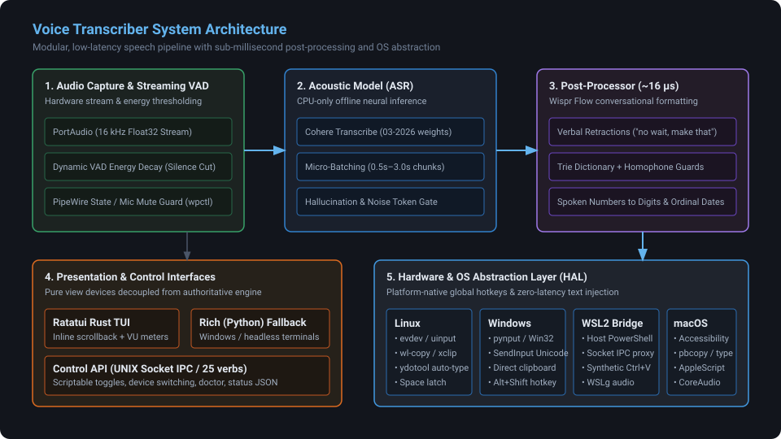
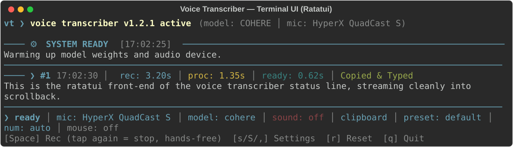

# I built an offline dictation engine, and the speech recognition was the easy part

*Draft — for review before publishing.*


*The real terminal UI — transcriptions scroll above a live prompt line.*

---

## The problem with dictation in 2026

I type for a living. I have tried the hosted dictation products, and they are
genuinely impressive: the transcription quality is high and the latency is
acceptable. I stopped using them for three reasons that turned out to be
unfixable within that design.

1. **Your voice leaves the machine.** Every sentence you dictate — the client
   name, the incident details, the credentials you read out loud by accident —
   transits someone else's infrastructure. I write about other people's systems.
   That is not a trade I can make.
2. **Something breaks when the network does.** Dictation is most valuable
   exactly when I am heads-down and do not want to context-switch. A round trip
   to a data centre is a dependency, and dependencies fail.
3. **It is a subscription, and the ceiling is somebody else's product plan.**

So I looked at local options. The obvious answer is Whisper. I ran it. It works,
and the transcription is good — but the experience around it is not, for two
reasons that are much more interesting than accuracy:

- **Whisper hallucinates on silence.** Feed it a quiet room and it will
  confidently return *"Thank you for watching!"* or *"Subtitles by…"* — training
  data leaking back out, because the model was trained to transcribe YouTube
  captions and never learned that "nothing was said" is an acceptable answer.
- **Nothing about it is a dictation *tool*.** There is no global hotkey. There is
  no "hold this chord anywhere in the OS, speak, release, and the text appears in
  the window that had focus". You get a Python function that turns a WAV into a
  string, and then you get to build the rest.

Voice Transcriber is the rest. It is a dictation *engine*: hold a global chord,
talk, release, and clean text lands in whatever window is focused — a browser, an
IDE, a terminal, a chat app. It runs entirely on your machine. It has no account,
no API key, no telemetry and no network dependency after the model is on disk.

This is a post about the parts that were hard, and it is not the part you would
expect. The speech recognition was the easy part; it was a dependency choice and
a beam search. **Getting an operating system to reliably capture your voice and
to accept synthetic keystrokes is where the dragons are.**

---

## Architecture: one core, four hosts, one place to branch

The engine has to run on Linux (Wayland and X11), native Windows, Windows via
WSL2, and macOS. Those four environments disagree about almost everything that
matters here.



*One core, four hosts: only the hotkey, injection, audio and notification backends differ.*

The organising rule is that everything cross-platform is shared, and exactly
four things are per-OS:

| Concern | Linux | Windows | WSL2 | macOS |
| :--- | :--- | :--- | :--- | :--- |
| **Global hotkeys** | `evdev` | `pynput` | PowerShell bridge | `pynput` |
| **Clipboard / typing** | `wl-copy`, `ydotool`/`xdotool` | Win32 `SendInput` | host-side paste | `pbcopy` + Quartz |
| **Audio cues** | `mpg123` | `winsound` | WSLg | `afplay` |
| **Notifications** | `libnotify` / tkinter | tkinter | tkinter | `osascript` |

Everything else — audio capture, VAD, the ASR call, the post-processor, the
configuration model, the control API — is one implementation.

There is a Hardware/OS Abstraction Layer in `src/voice_transcriber/platform/`,
and the rule I enforced on myself is that **it is the only place in the codebase
that branches on the operating system.** Not "mostly", not "except this one
place". If you grep for `sys.platform` outside `platform/`, you have found a bug.
That is what keeps four backends from drifting into four subtly different
programs, and it is why "user-configurable key bindings" was a one-file change
rather than a four-file change (more on that below).

The engine is Python: audio via PortAudio, the model via PyTorch. Python is the
right choice for the engine because the interesting work is numerical and
library-shaped. It is the wrong choice for a responsive terminal UI, which is why
the frontend is a separate Rust binary that talks to the engine over a UNIX
socket — the engine owns all state, the frontend is a pure view and input device.
More on that later.

---

## Choosing the acoustic model

The only plug-in backend today is Cohere Transcribe
(`CohereLabs/cohere-transcribe-03-2026`, Apache-2.0, ~3.9 GB of weights). I picked
it over Whisper-family models for three reasons:

1. **It does not hallucinate into silence.** This is the single biggest
   usability difference. The pipeline's contract is that a quiet room returns the
   empty string. There is an explicit test for it.
2. **CPU inference is fast enough to be interactive.** Dictation has a hard
   latency feel: if the text does not appear within roughly a second of releasing
   the key, it stops feeling like typing and starts feeling like submitting a job.
3. **It is Apache-2.0**, so shipping the weights as a download is
   straightforward.

I did not want to hand-wave "it's accurate". So there is a reproducible
evaluation harness in `eval/` that scores the **real** pipeline — the actual
streaming batcher, the actual post-processor — over 154 clips across seven
slices, and it reports word error rate, character error rate, exact-match rate
and silence-hallucination rate. The current baseline, on CPU with dynamic int8
quantisation:

| slice | n | WER | CER | exact match |
| :--- | ---: | ---: | ---: | ---: |
| clean read speech | 44 | **2.81%** | 1.43% | 70.5% |
| noisy (SNR 5–20 dB) | 24 | **3.01%** | 1.24% | 70.8% |
| long-form (15–40 s) | 12 | **1.78%** | 0.87% | 50.0% |
| technical vocabulary | 28 | **8.44%** | 5.46% | 50.0% |
| technical + noise | 12 | 8.12% | 4.52% | 50.0% |
| accented meeting speech | 22 | 12.32% | 7.66% | 13.6% |
| **overall (speech)** | **142** | **5.10%** | **2.97%** | **54.2%** |
| **silence hallucination** | **12** | — | — | **0/12** |

Two things worth saying about that table, because the honest version is more
useful than the flattering one:

- The `accented` number is bad, and it is partly an artefact. That slice is AMI
  meeting speech, whose references contain disfluencies and repetitions — and the
  post-processor *deliberately deletes those*, so the "errors" include things the
  pipeline did on purpose. It is an upper bound, not a clean measurement.
- The `technical` slice is synthesised with TTS, which pronounces `systemctl` and
  `0xDEADBEEF` differently from a human. That makes it a **lower** bound on real
  difficulty. Both caveats are written down in `eval/README.md` rather than
  buried.

I would rather publish a table with caveats than a single impressive number.

---

## The part that actually makes it feel like typing

Raw ASR output is not usable as text. If you hold a key and talk, you produce
filler, false starts and self-corrections, and you produce them at
conversational speed:

> "remind me tuesday no wait make that wednesday uh and uh also add a note to the
> github issue"

A dictation engine that types that verbatim is a novelty. The post-processor
turns it into:

> "Remind me Wednesday and also add a note to the GitHub issue."

The correction is resolved, the filler is gone, and every remaining word is the
one that was spoken. Note what it does *not* do: it does not reflow that into two
sentences. This stage never adds punctuation that was not spoken, which is what
keeps it predictable — no model, no network, no surprises. A model-backed polish
pass does exist as an opt-in (`enable_slm`, off by default, needs a local vLLM),
but it is not what makes this example work: everything above is regex and tries.

It does this in **13–35 microseconds** — measured, not estimated. The whole thing
is regex and tries, no model, no network, and that is a deliberate design
constraint: this stage runs on every single utterance, so it must be
effectively free, and it must be predictable. It handles:

- **Verbal retraction** — `"no wait"`, `"make that"` and `"I mean"` replace the
  retracted value (`"Tuesday, no, Wednesday"` → `"Wednesday"`, `"at 5 PM,
  actually 6 PM"` → `"at 6 PM"`), and `"scratch that"` trims the preceding
  clause. A marker inside ordinary speech is left alone: `"please make that
  happen"` and `"there is no Wednesday meeting"` are not retractions, so neither
  is rewritten.
- **Filler and stutter collapse** — `"uh"`, `"um"`, and `"the the"`.
- **Spoken numbers and dates** — `"October twentieth"` → `"October 20th"`,
  `"October twentieth twenty twenty five"` → `"October 20th, 2025"`, with three
  modes (always digits / never / auto, where auto only converts unambiguous runs
  like phone and serial numbers and leaves `"I have 2 dogs"` as `"I have two
  dogs"`).
- **Serial numbers and NATO dictation** — `"A B C 1 2 3"` → `"ABC123"`,
  `"Alpha Bravo 4"` → `"AB4"`.
- **A personal dictionary**, matched through a compacted trie, in two layers: a
  committed `config/dictionary.yaml` for shared tooling vocabulary, and a
  gitignored `config/dictionary.local.yaml` for your hostnames, colleagues and
  client codenames. It reloads on change, so you can fix a mishearing while
  dictating.

The dictionary has a subtlety I am pleased with. ASR makes *phonetic* errors, and
phonetic errors collide with real English. `"get tea"` should become `Gitea` when
you are talking about a git remote — and must stay `"get tea"` when you are
talking about tea. So the dictionary supports **contextual rules** with triggers
and guards:

```yaml
contextual_rules:
  - target: Gitea
    spoken: ["get tea", "git tea", "git ea"]
    triggers_before: ["push to", "pull from", "clone from", "hosted on"]
    triggers_after: ["server", "instance", "repo", "remote", "url"]
    guards: ["cup of", "drink", "hot", "iced", "would you like to"]
```

`"push to get tea"` becomes `"push to Gitea"`; `"a cup of get tea"` does not
become anything. This is a small idea that makes the feature usable in practice,
because a dictionary that corrupts normal speech is worse than no dictionary.

---

## The dragons, part 1: a microphone that lies to you

Here is the one that cost me the most time, and it is the reason the app now has
a `doctor` command.

A PipeWire audio source can be **muted**. That sounds simple. It is not, because
a muted source is not *broken* in any way that any API reports:

- it enumerates as an input device, with the right name;
- it opens cleanly;
- it reports sane channel counts and a sane sample rate;
- PortAudio's format check passes;
- and then it records **exact zeros**, forever.

Every check I had said the microphone was healthy, while Discord said *"no audio
input detected"* and the app transcribed nothing. I only found it after dumping
the raw samples and seeing `0.00000000` for the entire buffer. The `capture` was
working perfectly. It was capturing silence.

The repair is one command (`wpctl set-mute @DEFAULT_AUDIO_SOURCE@ 0`), but
diagnosing it requires knowing that "opens fine, records silence" is a *state*,
not a failure. So `doctor` now checks for it explicitly and fails loudly, and
`doctor --fix` performs the repair — but only when you ask, because a mute can be
deliberate. The app also refuses to leave a microphone muted if it ever mutes one
for a test.

The related failure is the *opposite* of a lie: **PortAudio builds its device
list exactly once, at `Pa_Initialize()`, and silently omits any device it cannot
open at that moment.** So if another application was holding your USB microphone
when the engine started, that microphone is not in the list — not marked
unavailable, simply absent, for the lifetime of the process. I reproduced it on
demand: 6 devices listed in a fresh process, 5 in the one that started while
another process held `hw:4,0`. The settings modal now has a **Reset Microphones**
action that drops the warm stream cache, re-initialises PortAudio, and re-resolves
your selected microphone *by name* — because device indices are list positions and
they shift whenever the list changes (I watched `default` move 9 → 8 → 9 in one
session).

## The dragons, part 2: a terminal that corrupts itself

The Rust frontend draws a TUI in your terminal. PortAudio writes ALSA errors to
`stderr`. Those are the same stream.

I added a microphone picker that meters every visible input device at once — one
`InputStream` per row, so you can see which microphone is actually hearing you.
My first implementation tried to open each device at 16 kHz and fell back to the
device default if that failed. Reasonable. But every device that refuses 16 kHz
makes PortAudio print an ALSA error to `stderr`, and five of those per frame,
sixty frames a second, painted garbage straight over the UI: stale bars, rows
stuck at zero, an unreadable popup.

The fix was to stop probing by opening. `sd.check_input_settings` calls
`Pa_IsFormatSupported`, which negotiates the format without opening a stream, so
each device is opened exactly once, at a rate it has already agreed to. Measured
result: **9 ALSA `stderr` lines per frame → 0**, with all five devices still
streaming. That is a good example of a bug that is invisible in headless tests
and obvious the moment a human looks at a terminal.

## The dragons, part 3: modifiers that latch forever

Global hotkeys on Linux mean reading raw kernel events from `/dev/input/event*`
and knowing which modifier keys are held. The obvious implementation keeps a set:
add on key-down, remove on key-up.

The obvious implementation is wrong, and it fails in a way that looks like a
haunted keyboard. If you **never receive the key-up** — because a remapper grabbed
the device mid-press, because a wireless keyboard disconnected, because a file
descriptor was reused — the modifier stays latched forever. Afterwards, pressing
*Alt* alone triggers your *Alt+Shift* push-to-talk, and the app records when you
did not ask it to.

The fix is to stop trusting your own event cache and ask the kernel: `EVIOCGKEY`
(via `active_keys()`) returns the live key bitmap for that device. But the live
bitmap has the mirror-image problem: **a grabbed keyboard's bitmap still reports
the pre-remap key.** I hit exactly this with `kanata` remapping the Right-Alt
*position* to Right-Ctrl — the bitmap kept saying `KEY_RIGHTALT` was held, and a
naive live-state read invented an Alt the user had already removed.

So the shipped rule is that a modifier counts only when **both** agree: the
device's event stream says it is down, *and* the kernel bitmap says it is down,
tracked per device path. Each half is load-bearing, and each covers the other's
failure mode. That is the kind of thing that is not in any tutorial, and it took
a bug report against my own keyboard to find.

---

## Cross-platform input injection, without hacks

Typing text into another application is where the platforms diverge most.

**Linux.** Under Wayland there is deliberately no supported protocol for one
application to synthesize keystrokes into another, so typing goes out through
`ydotool` (which itself drives `/dev/uinput`) on Wayland or `xdotool` on X11, and
clipboard output through `wl-copy` or `xclip`, chosen at runtime. The *hotkey*
side reads raw kernel events from `/dev/input/event*`, and the mouse features —
middle-click push-to-talk, and left+right within 50 ms as `Enter` — mirror the
real mouse through a `/dev/uinput` virtual device, so the original clicks can be
swallowed and replayed untouched.

**Windows.** `SendInput` with `KEYEVENTF_UNICODE`, which types emoji and non-ASCII
correctly where the old scancode approach cannot.

**WSL2.** This one is genuinely fun: the engine runs in the Linux guest, but the
keyboard and the focused window are on the Windows host. So a PowerShell process
on the host watches global hotkeys, and communicates with the guest over a socket;
transcription text is pasted on the host side. The guest never sees the real
keyboard.

Because hotkeys and the hands-free latch have to work identically across all four,
the *chord vocabulary and the per-platform key tables live in exactly one file*
(`keybinds.py`). One table of keys — canonical name, aliases, Linux evdev code,
Windows virtual-key code, pynput attribute — derives every backend's lookup. That
is what made bindings a one-file change instead of four, and it means a user cannot
get three different keyboards depending on which host they launched.

The latch semantics are worth a sentence, because "hold to talk" and "tap to latch"
interact. While holding your chord, tapping `Space` *latches* the recording
hands-free: you can release both keys and keep talking, then tap the chord again
to finish. The WSL bridge has to mirror this exactly — it withholds the
key-up event while latched — so the same gesture works whether the hotkey is
served by `evdev`, `pynput`, or a PowerShell process on the other side of a
virtualisation boundary.

---

## Python engine, Rust frontend, and why they are separate

The frontend is a Rust binary built on [ratatui](https://ratatui.rs). It is
launched by the engine and connects back over a UNIX socket with
newline-delimited JSON.



*The Rust frontend owns no state — it renders what the engine tells it and sends commands back.*

The split exists because the two halves want different things. The engine wants
PyTorch and PortAudio and is naturally Python. A terminal UI wants sub-frame
redraws, precise handling of raw mode and resize, and no garbage collector —
which is naturally Rust. Making the frontend a *separate process* also gives a
property I care about: **the engine is authoritative and the UI cannot corrupt
it.** The frontend renders state it is told and sends commands; it owns nothing.
If it crashes, dictation still works.

The same socket is a public API. `python src/main.py` is itself a client, so you
can drive a running engine from a script:

```bash
python src/main.py status --json
python src/main.py start
python src/main.py stop
python src/main.py wait --json      # includes the transcript
python src/main.py hotkey add ctrl+shift
python src/main.py help --json      # machine-readable verb catalogue
```

That is how the integration tests drive a **real running instance** instead of
mocking internals — and it is why `help --json` is the source of truth for the
command surface rather than a list in a document.

---

## Shipping 4 GB of weights without shipping 4 GB

The model is ~3.9 GB of `safetensors`. It cannot go in the repository, and GitHub
caps a release asset at 2 GiB.

The bundle is therefore split into raw byte-range parts, compressed with `xz`,
and published to a release tag derived from the **model revision**, not the app
version:

```
model-cohere-499888924f5f/
  cohere-transcribe-...part1.xz      1.46 GB
  cohere-transcribe-...part2.xz      1.46 GB
  cohere-transcribe-...SHA256SUMS    268 B
```

The client downloads the parts, verifies them against `SHA256SUMS`, decompresses
and reassembles them in pure Python (`urllib` + `lzma` + `tarfile` — no `xz`
binary, no `7z`, nothing to install), and installs the result into a per-user data
directory.

The important property is that the tag is **revision-keyed**. A new app release
normally changes no weights, so it publishes nothing and reuses the existing
bundle. Only a change to the model revision creates a new bundle — which is
published by a script that reads its constants *out of the client module*, so the
two cannot drift apart. `SHA256SUMS` is uploaded last, so a partially-published
bundle is never resolvable.

It also means the install works fully offline: put the bundle in a `model-bundle/`
directory next to the executable and the app assembles it locally.

---

## What I got wrong

I am going to include this section because a post about engineering that only
contains things that worked is not a useful post.

Late in the project I turned on a linter for the first time, on a codebase that
already had ~980 passing tests and four green CI jobs. It immediately found
three real bugs the tests never caught.

**1. Three settings were silently discarded.** `LANGUAGE`,
`WAIT_FOR_MODEL_ON_STARTUP` and `ENABLE_SLM` are module-level globals, but the
function that loads the config assigned to them *without declaring them global* —
so Python created local variables and the globals never changed. Consequences:
setting `language: fr` in the config did nothing, and saving the config then
wrote `language: en` back over your file. `enable_slm` could never turn on.

**2. A user-facing feature was dead.** `reset_terminal()` used `sys.platform`
early in its body, then did `import sys` later in the same function. That makes
`sys` a *local* for the whole function, so the early access raised
`UnboundLocalError` — every single time — and the enclosing `except Exception`
swallowed it. The "reset terminal & clipboard bridge" key silently did nothing.
(Beautiful detail: the linter's *own* autofix had previously split
`import termios, sys` into two lines, which kept the bug alive.)

**3. The TUI offered settings the engine does not have.** The Rust frontend's
output-mode cycle stepped through `clipboard → type → type_fast → paste →
paste_terminal`. The engine's `OUTPUT_MODES` is exactly
`["clipboard", "type", "type_fast"]`. So two presses past the end showed you a
`[PASTE]` mode that did not exist, then the engine's next state update snapped it
back.

There were also two honest robustness problems worth naming: the notification
overlay built a Python script by **string interpolation** and executed it with
`python -c` (so a `"` in the text broke it, and a crafted one injected code — it
now emits `repr()` literals), and the list of overlay child processes was shared
between worker threads and the main thread **without a lock**.

The lesson is not "use a linter". It is that **tests prove what you thought to
test.** This codebase has excellent coverage of the paths someone thought about
— and three settings that no test ever touched, because the tests set them
directly instead of through the config file. Coverage is not correctness; it is
the shape of your own assumptions.

---

## Testing an app that touches four operating systems

The suite is tiered by what it needs, and that structure is what makes it
practical:

| Tier | Needs the model? | Runs where |
| :--- | :--- | :--- |
| `tests/shared/` | No | Every OS, every push |
| `tests/{linux,macos,windows,wsl}/` | No | That OS only |
| `tests/e2e/` | Yes, plus audio hardware | Locally only, never CI |

The shared tier is **hermetic** — no model, no microphone, no network, no
touching the user's real config — so it runs in seconds on every platform, and CI
runs four jobs (Linux, macOS, Windows, and a simulated WSL job) plus a lint step
and a build of the Rust frontend. Just under a thousand tests currently.

The tiering is what let me be honest about a hard limit: the PowerShell bridge
that serves WSL hotkeys **cannot run in CI**, because the Ubuntu runner has no
`powershell.exe`. So its contract is pinned *structurally* — tests assert the
exact VK-code string the Python side sends and that the script parses — and the
untested-on-real-hardware status is written down in `TODO.md` with the exact
verification steps, rather than implied to work. Several things in this project
are "verified on Linux, expected on macOS, unverified on Windows", and the docs
say exactly that. I would rather a user knows what has not been proven.

---

## Try it

- **Linux:** `vt-x86_64.AppImage` from [releases], or `nix run github:jjamesmartiin/voice-transcriber`
- **Windows:** `VoiceTranscriber-windows-x86_64.zip` — self-contained, no Python needed
- **macOS / from source:** `./scripts/setup.sh` then `./scripts/run.sh`, or `nix run .`

Hold **Alt+Shift**, talk, release. Tap **Space** while holding it to latch
hands-free. Bind anything you like with `vt hotkey add …` — including a single key
such as `f13`, or a chord your keyboard remapper produces. Run `./scripts/run.sh doctor`
if your microphone is being difficult; there is a decent chance it is the muted-
source bug above.

- Source: [github.com/jjamesmartiin/voice-transcriber](https://github.com/jjamesmartiin/voice-transcriber)
- License: MIT. The model weights are Apache-2.0.
- 100% local. No accounts, no keys, no telemetry.

**If you only take one thing from this post:** the model is the part you can
download. The part you have to *engineer* is a microphone that tells the truth, a
modifier that does not latch, and a terminal that does not eat its own UI.

[releases]: https://github.com/jjamesmartiin/voice-transcriber/releases/latest
