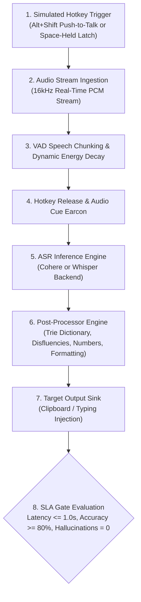
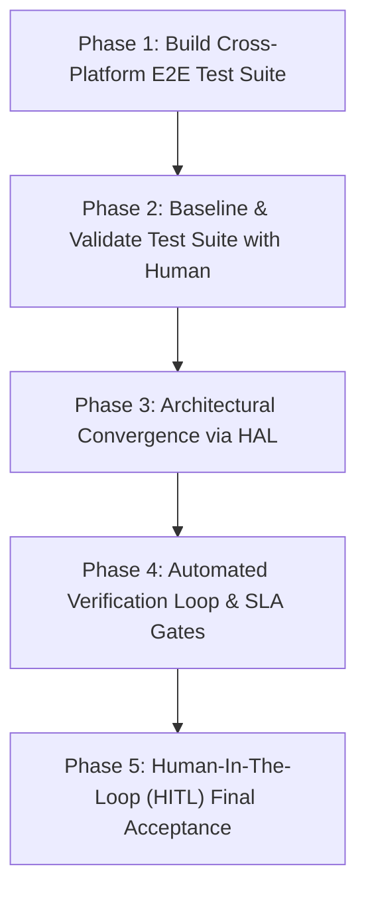

# Cross-Platform Convergence & Automated HITL Testing Plan

## Overview & Motivation

Voice Transcriber currently has three divergent branches branched from commit `8b2b0ad`:
1. **`main` (Linux Wayland/X11)**: Cutting-edge core algorithms — Trie dictionary (`test_dictionary.py`), dynamic VAD energy decay, real-time micro-batching, post-processor (disfluency removal, verbal retractions, numbers to digits, formatting levels), Rich TUI dashboard, non-blocking model downloads, and benchmark test suites.
2. **`main-windows` (Native Windows)**: Windows-specific hotkey listener (`hotkeys_windows.py` via `pynput`/`keyboard`), notifications with Windows sound chimes (`notifications_windows.py`), `main_windows.py`, `run.ps1`, and PyInstaller offline build scripts (`build_offline.py`). Diverged before the advanced post-processor and micro-batcher improvements.
3. **`main-wsl` (NixOS WSL)**: Host-guest bridge architecture (`wsl_bridge.py`, `wsl_bridge_host.py`, `wsl_win_hotkeys.ps1`), Windows host clipboard interop via `clip.exe` / PowerShell `Set-Clipboard`, PulseAudio/PipeWire ALSA fixes, and `run_wsl.ps1`. Also diverged from `main`.

### The Core Problem
Relying solely on AI agents to merge these branches leads to subtle cross-platform regressions (missing Windows imports on Linux, broken hotkey hooks on Windows, audio callback starvation, latency degradation). Asking a human to test broken intermediate code wastes valuable time on basic debugging ("airing out work").

### The Guiding Principle: Test-First, AI-Driven, HITL-Verified
1. **Full End-User Testing First**: Build an automated test harness that simulates the *entire physical user journey* across Linux, WSL, and Windows before changing implementation code.
2. **Confirm Test Harness with Human**: Verify that the automated tests faithfully test what the human actually expects.
3. **Automated AI Implementation**: Merge branches behind a unified Platform Abstraction Layer (HAL) using automated agents.
4. **Automated Gate Enforcement**: Code must pass strict quantitative SLA gates (latency $\le 1.0\text{s}$, accuracy $\ge 80\%$, $0$ hallucinations).
5. **Human-In-The-Loop (HITL) Acceptance**: The human only performs the final qualitative acceptance test on an already verified, smooth, non-crashing system.

---

## What "Full End-User Testing" Means

An end-to-end test cannot just call `transcribe()` on a file. It must test the actual user execution pipeline:



---

## Quantitative SLA Gates

| Gate Metric | Target SLA | Hard Ceiling | Rule |
| :--- | :--- | :--- | :--- |
| **Post-Release Latency** | $\le 1.00\text{ s}$ | $\le 1.50\text{ s}$ | Time from key release (`stop_recording`) to clipboard paste or active window typing. |
| **Transcription Accuracy** | $\ge 90.0\%$ (Target 100%) | $\ge 80.0\%$ | Sequence matching against ground-truth benchmarks across words, phrases, and 30s speech. |
| **Hallucination Rejection** | $0$ unwanted tokens | $0$ unwanted tokens | Ambient room noise, background hum, or short breath must output empty string `""`. |
| **Punctuation & Formatting** | $100\%$ terminal coverage | $100\%$ coverage | Multi-word sentences must terminate with valid punctuation (`.`, `!`, `?`). |
| **Platform Portability** | Zero import/syntax errors | Zero platform regressions | Linux code must not fail on Windows; Windows code must not fail on Linux/WSL. |

---

## 5-Phase Convergence & Execution Roadmap



---

### Phase 1: Build the Cross-Platform E2E Test Suite

**Goal:** Create a unified automated test runner (`tests/test_end_to_end_crossplatform.py`) that exercises the entire pipeline end-to-end and works across Linux, WSL, and Windows Native.

1. **Acoustic & Stream Ingestion Simulation:**
   - Feed benchmark audio files (`tests/test_transcribe/{short_word,short_phrase,long_30s}.mp3` and silent noise) into the transcriber queue at real-time 1x sample rates without bypassing VAD or micro-batching.
2. **Synthetic Hotkey Triggering:**
   - Programmatically exercise both Push-to-Talk (Alt+Shift down $\to$ wait $\to$ Alt+Shift up) and Hands-Free Latch (Alt+Shift down $\to$ Space tap $\to$ Alt+Shift up $\to$ Alt+Shift tap).
3. **Cross-Platform Output Verification:**
   - Intercept and assert output on:
     - **Linux:** X11/Wayland clipboard (`wl-copy`/`xclip`) and virtual keystrokes (`ydotool`/`xdotool`).
     - **WSL:** Windows host clipboard (`clip.exe` / PowerShell interop) and bridge socket communication (`wsl_bridge.py`).
     - **Windows Native:** `pyperclip` / Win32 clipboard APIs and `winsound` earcons.
4. **Mocked Platform Test Adapters:**
   - Provide contract mocks for Windows/WSL APIs (`ctypes.windll`, `clip.exe`, PowerShell bridge sockets) so that Windows and WSL code paths can be executed and validated directly on Linux CI/NixOS environments without runtime import crashes.
5. **Fix Pre-existing Test Failures on `main`:**
   - Fix `test_transcribe.py` trailing period assertion (`TODO.md`).
   - Resolve CPU benchmark timeouts in `test_performance.py` and `test_power_cpu.py`.

---

### Phase 2: Human Verification of the Test Harness (Baseline & Validation)

**Goal:** Confirm the test suite does what the human expects *before* merging or rewriting implementation code.

1. Run the test harness on the current working baseline:
   ```bash
   nix develop --command python -m pytest tests/test_end_to_end_crossplatform.py -v
   nix develop --command python tests/test_live_speaker_mic_loopback.py all
   ```
2. Review the benchmark outputs, latency numbers, and assertion criteria with the human.
3. Confirm that:
   - The test phrases represent realistic daily dictation.
   - The latency timer measures actual key-release-to-paste time.
   - Failure reports are clear, actionable, and informative.
4. Once approved, lock the test suite as the immutable standard for Phase 3.

---

### Phase 3: Architectural Convergence (Unifying the 3 Branches)

**Goal:** Eliminate divergent forks and monkey-patching (`main_windows.py`) by creating a single, modular codebase with a **Hardware/OS Abstraction Layer (HAL)** in `src/platform/`.

#### Target Directory Structure:
```
src/
├── main.py                     # Single cross-platform entry point (auto-detects OS)
├── t2.py                       # Unified audio pipeline & ASR dispatch
├── micro_batcher.py            # Micro-batching & VAD chunking (from main)
├── post_processor.py           # Unified disfluency, Trie dictionary & formatting (from main)
├── transcribe_cohere.py        # Cohere backend
├── transcribe_whisper.py       # Whisper backend
├── tui.py                      # Rich TUI dashboard (gracefully degrades on raw terminals)
│
├── platform/                   # Hardware/OS Abstraction Layer (HAL)
│   ├── __init__.py             # detect_platform() -> 'linux' | 'wsl' | 'windows'
│   │
│   ├── hotkeys/                # Unified Hotkey Interface
│   │   ├── base.py             # Abstract Base Class (start, stop, config callbacks)
│   │   ├── linux.py            # Linux evdev / uinput / ydotool (from main)
│   │   ├── windows.py          # Windows pynput / Win32 hooks (from main-windows)
│   │   └── wsl.py              # WSL socket bridge client (from main-wsl)
│   │
│   ├── clipboard/              # Unified Clipboard & Typing Sink
│   │   ├── base.py             # Abstract Base Class (copy_text, paste_keystrokes)
│   │   ├── linux.py            # wl-copy, xclip, ydotool
│   │   ├── windows.py          # pyperclip, SendInput, user32
│   │   └── wsl.py              # clip.exe, PowerShell host bridge
│   │
│   ├── audio_cues/             # Unified Sound Cue Player
│   │   ├── base.py             # Abstract Base Class (play_start, play_stop)
│   │   ├── linux.py            # libcanberra, paplay, aplay, sounddevice
│   │   ├── windows.py          # winsound, native Windows WAV chimes
│   │   └── wsl.py              # Windows host proximity chimes via bridge
│   │
│   └── bridge/                 # WSL Host-Guest IPC
│       ├── wsl_bridge_server.py # Daemon inside WSL (from main-wsl)
│       └── wsl_win_hotkeys.ps1  # Lightweight PowerShell host runner (from main-wsl)
│
└── packaging/                  # Platform launch & build scripts
    ├── flake.nix               # NixOS Linux & NixOS WSL packaging
    ├── run.sh                  # Linux & WSL launcher
    ├── run.ps1                 # Windows launcher & setup
    ├── setup_wsl.ps1           # WSL automated host installer
    └── build_offline.py        # PyInstaller Windows bundle script
```

#### Key Implementation Steps:
1. Extract `hotkeys_windows.py` and `notifications_windows.py` from `main-windows` into `src/platform/windows/`.
2. Extract `wsl_bridge.py` and `wsl_win_hotkeys.ps1` from `main-wsl` into `src/platform/bridge/` and `src/platform/wsl/`.
3. Refactor `main.py` to instantiate `PlatformManager` dynamically based on `detect_platform()`.
4. Ensure all advanced features from `main` (Trie dictionary, formatting levels, dynamic VAD, model auto-download) are active regardless of host platform.

---

### Phase 4: Automated Verification & Gate Enforcement

**Goal:** Run the entire test matrix automatically. The AI agent diagnoses and fixes any regressions without human intervention.

Execute the multi-tier automated test suite:
```bash
# 1. Component unit tests (dictionary, post-processor, micro-batcher, config)
nix develop --command python -m pytest tests/test_dictionary.py tests/test_micro_batcher_fast.py tests/test_config_sync.py

# 2. Platform adapter contract tests (Linux, WSL mock, Windows mock)
nix develop --command python -m pytest tests/test_end_to_end_crossplatform.py -k "adapter"

# 3. Full synthetic E2E pipeline & latency benchmarks
nix develop --command python tests/benchmark_synthetic_e2e.py

# 4. Full acoustic loopback suite across all samples
nix develop --command python tests/test_live_speaker_mic_loopback.py all
```

**Passing Criteria:**
- 100% test pass rate across unit, adapter, and synthetic tests.
- Latency SLA $\le 1.0\text{s}$ (hard ceiling $\le 1.5\text{s}$).
- Accuracy SLA $\ge 80\%$ (target 100%) on all benchmark samples.
- Zero silence/noise hallucinations.

---

### Phase 5: Human-In-The-Loop (HITL) Final Acceptance

**Goal:** The human validates the polished, non-crashing system in real-world conditions with zero wasted time.

#### Human Test Script:
1. **Launch the Application:**
   - **Linux:** `nix run .` (or `python src/main.py`)
   - **Windows WSL:** `./run.sh`
   - **Windows Native:** `.\run.ps1`
2. **Push-to-Talk Test:**
   - Focus any text editor (Notepad, browser, terminal).
   - Press and hold `Alt+Shift`.
   - Speak: *"Testing voice transcriber low latency dictation."*
   - Release `Alt+Shift`.
   - **Verify:** Text pastes almost instantly ($\le 1.0\text{s}$), audio chime plays cleanly, transcription is accurate.
3. **Hands-Free Latch Test:**
   - Press and hold `Alt+Shift`, tap `Space`, release keys.
   - Speak naturally for 10 seconds.
   - Tap `Alt+Shift` to stop.
   - **Verify:** Long passage is transcribed with proper punctuation and formatting.
4. **Settings & TUI Test:**
   - Press `Ctrl+Alt+I`.
   - Cycle through settings (devices, models, number conversion, formatting levels).
   - Exit with `c`.
   - **Verify:** Settings persist to `config/config.yaml` and TUI updates smoothly.

---

## Action Plan for Getting Started at Home

When ready to begin, start directly on **Phase 1**:

```bash
# Ensure you are on the plan/convergence branch:
git checkout dev/converge-branches-plan

# Run existing tests to verify baseline:
nix develop --command python -m pytest tests/

# Begin Phase 1: Create the unified cross-platform E2E test harness
# File to create: tests/test_end_to_end_crossplatform.py
```
